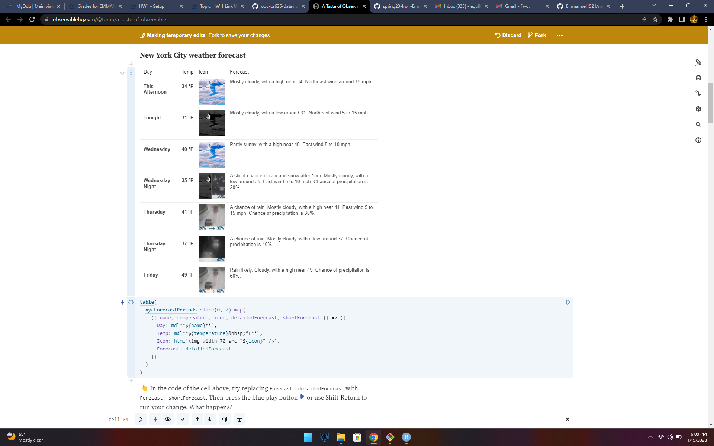
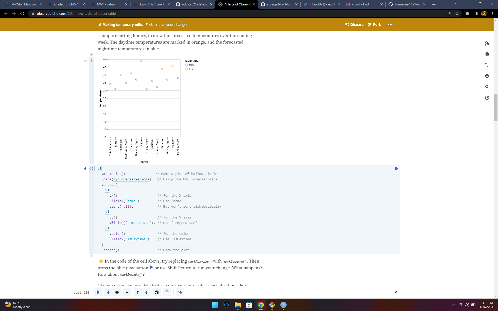
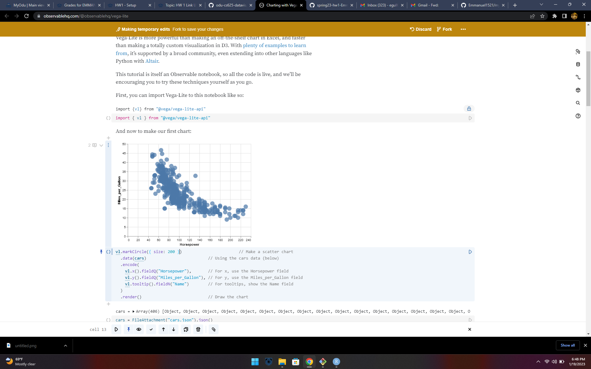
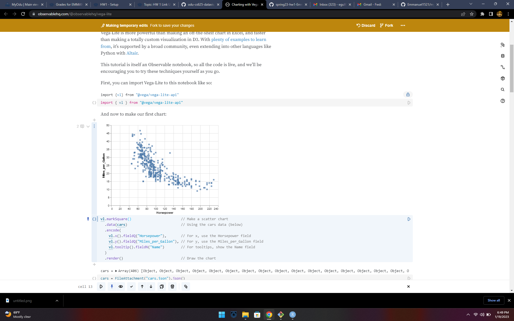

```{r setup, include=FALSE}
knitr::opts_chunk$set(echo = TRUE)
```

## Git, GitHub

1. *What is your GitHub username?*
 Emmanuel1521

2. *What is the URL of your remote GitHub repo (created through Mr. Kennedy's exercises)?*

My remote GitHub repo url: https://github.com/Emmanuel1521/myrepo.git

## R

The command below will load the tidyverse package.  If you have installed R, RStudio, and the tidyverse package, it should display a list of loaded packages and their versions.
```{r}
library(tidyverse)
```

## R Markdown 

1. *Create a bulleted list with at least 3 items*
 
* Computer
* CPU
* Mouse

2. *Write a single paragraph that demonstrates the use of italics, bold, bold italics, code, and includes a link. The paragraph does not have to make sense.*
 
 This is ***Data visualization course***.

  <html>
    <head>
      Hi,CS 625 is the course number for Data Visualization
    </head>
  </html>
  
  
My favourite search engine is [Duck Duck Go](https://duckduckgo.com).

3. *Create a level 3 heading*

### This is Level 3 heading.

## R 

#### Data Visualization Exercises

1. (Q2) *How many rows are in mpg? How many columns?*
 
 234 rows and 11 columns are in mpg.

1. (Q4) *Make a scatterplot of hwy vs cyl.*
 
```{r} 

library(tidyverse)
ggplot(data = mpg) + 
  geom_point(mapping = aes(x = hwy, y = cyl))
```


#### Workflow: basics Exercises

1. (Q2) *Tweak each of the following R commands so that they run correctly (`library(tidyverse)` is correct):*

```r
library(tidyverse)
ggplot(dota = mpg) + 
  geom_point(mapping = aes(x = displ, y = hwy))

fliter(mpg, cyl = 8)

filter(diamond, carat > 3)
```
```{r}

library(tidyverse)
ggplot(data = mpg) + 
  geom_point(mapping = aes(x = displ, y = hwy))
             
filter(mpg, cyl == 8)

filter(diamonds, carat > 3)
```

## Google Colab

1. *What are the URLs of your Google Colab notebooks (both Python and R)?*

Python URL: https://colab.research.google.com/drive/1oaImBuNA0h3nPNQ2n5NWiGj4qMR_X9sf?usp=sharing 

R URL: https://colab.research.google.com/drive/1h6N0l-GSmR1KQ7fdCVGj835JcoWIsmua?usp=sharing

## Tableau

*Insert your the image of your final bar chart here*

1. *What conclusions can you draw from the chart?*


By selecting Machines, Tables, and Bookcases in the subcategory filter, I was able to compare the graphs of the East and South regions. With the exception of technology, we can see that all of the categories' sales in 2019 in the East and South Region follow the same pattern. The East area has the most phone sales, but the South has the highest sales of machines. However, despite the fact that the South region saw the largest machine sales in 2019 overall, the profit is really negative.


## Observable and Vega-Lite

### A Taste of Observable

1. *In the "New York City weather forecast" section, try replacing `Forecast: detailedForecast` with `Forecast: shortForecast`. Then press the blue play button  or use Shift-Return to run your change. What happens?*

In forecast column detailed description of the weather changed to short description.It just gives a short description such as sunny, rainy, cloudy,etc.




1. *Under the scatterplot of temperature vs. name, try replacing `markCircle()` with `markSquare()`. Then press the blue play button  or use Shift-Return to run your change. What happens? How about `markPoint()`?*

Under the scatterplot of temperature vs. name, when i'm replacing 'markcircle() with 'marksquare()' the circle plot representation changes to square and when it is changed to 'markPoint()' it is represented with hallow circles.





1. *Under "Pick a location, see the weather forecast", pick a location on the map.  Where was the point you picked near?*

Under "Pick a location, see the weather forecast, i picked a location on the map with longitude: -105.21 and latitude: 37.55.


1. *The last visualization on this page is a "fancy" weather chart embedded from another notebook.  Click on the 3 dots next to that chart and choose 'Download PNG'.  Insert the PNG into your report.*


### Charting with Vega-Lite

`markCircle()`

1. *Pass an option of `{ size: 200 }` to `markCircle()`.*

In the chart the representation of circles size have changed to 200.



1. *Try `markSquare` instead of `markCircle`.*

In the chart the representation  of circles changed to square.



1. *Try `markPoint({ shape: 'diamond' })`.*

In the chart the representation of plots changed into diamond shape.


`vl.x().fieldQ("Horsepower")`, ...

1. *Change `Horsepower` to `Acceleration`*

After changing `Horsepower` to `Acceleration` the scatter plots which are being on the left have shifted to right.


1. *Swap what fields are displayed on the x- and y-axis*

After swaping the x-axis and y-axis fields, the scatter plots shifted towards the top in the chart.


`vl.tooltip().fieldN("Name")`

1. *Change `Name` to `Origin`.*

After we change the 'Name' field to 'Origin',the names of the cars are changed to origin of the cars when we place the cursor on the points we can see the difference before and after changing.

Another example, `count()`

1. *Remove the `vl.y().fieldN("Origin")` line.*

When i removed the `vl.y().fieldN("Origin")` line, y-axis(origin) is not displayed and  in x-axis it showing the total number of records from all the origin's.

1. *Replace `count()` with `average("Miles_per_Gallon")`.*

When i replaced `count()` with `average("Miles_per_Gallon"), it is displaying the car's average miles per gallon of the particular origin country.


## References

*Every report must list the references that you consulted while completing the assignment. If you consulted a webpage, you must include the URL.*

* Insert Reference 1,https://observablehq.com/@observablehq/vega-lite
* Insert Reference 2,https://observablehq.com/@tomb/a-taste-of-observable
* Insert Reference 3,https://r4ds.had.co.nz/data-visualisation.html
* Insert Reference 4,https://github.com/odu-cs625-datavis/public/blob/main/Spr23/HW1.md
* Insert Reference 5,https://www.markdownguide.org/basic-syntax
* Insert Reference 6,https://www.earthdatascience.org/courses/earth-analytics/document-your-science/add-images-to-rmarkdown-report/
* Insert Reference 7,https://colab.research.google.com/notebooks/basic_features_overview.ipynb#scrollTo=JVXnTqyE9RET
* Insert Reference 8,https://r4ds.had.co.nz/workflow-basics.html#practice
